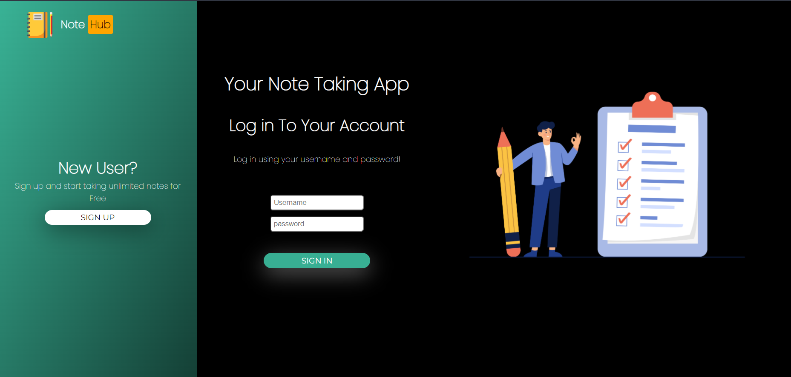
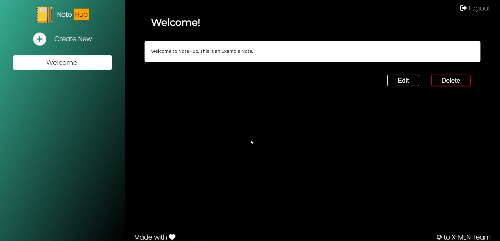

# Note Taking App - NoteHub

## A Student Utility Website Designed in the Hackoverflow event of [Prastuti](https://www.prastuti.in/)

 

This Web App is designed with the help of HTML , CSS and JavaScript for the frontend Purpose and for the backend the technology that we have used is node.js , express.js and mongodb. all the codes on the website is being written by our team members X-Men and the rights of it is reserved to the team X-Men :-) 

## Purpose of this WebPage

With the help of NoteHub you can create unlimited digital notes , Edit them whenever you want and delete them if you don't want the notes . The UI of the application is very simple to use and friendly and it helps you at such points where you need to take notes and books are not with you :p 

## How To Use

 This is our Landing Page of the website if you are new user than sign up here with your email-id, username and password otherwise simple log in with the help of your credentials.

After Signin/SignUP you will find the DashBoard where you will find the your all the notes on the left side and you can easily navigate with them with just a single click. 

### Here You Are with Note Hub now Create ,Edit ,Update and Delete as many Notes you want. 

If you want to edit any note just open the note and click on the edit button and then edit the note and save it

## NoteHub - Create Unlimited Notes

### Copyright to X-Men 
